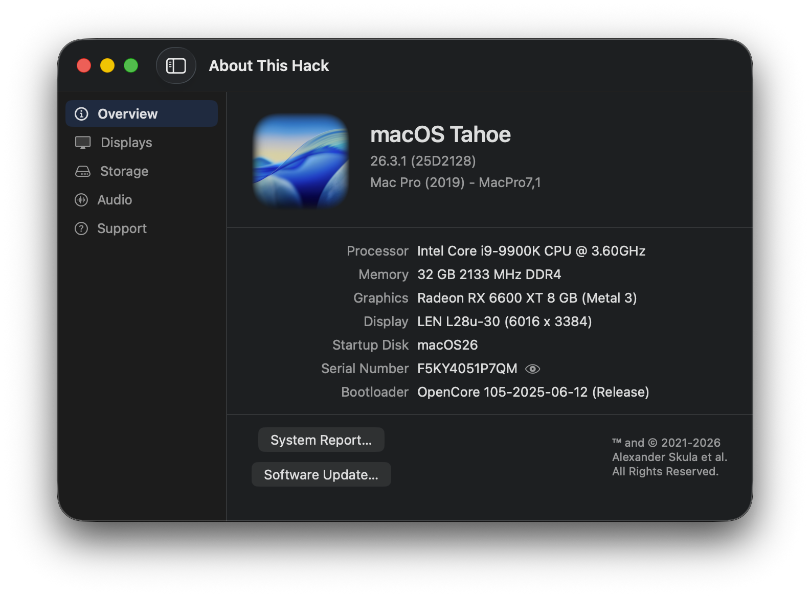
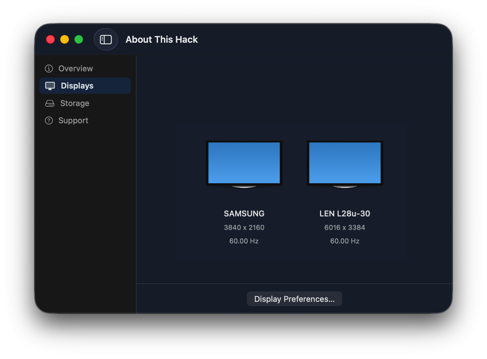
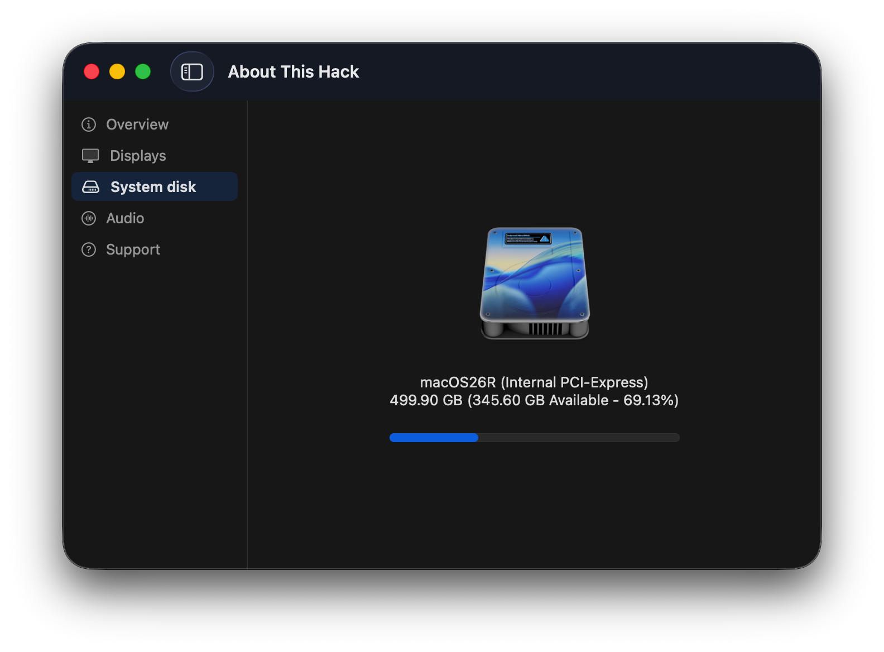
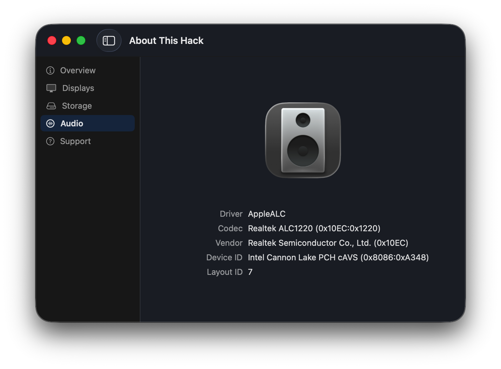
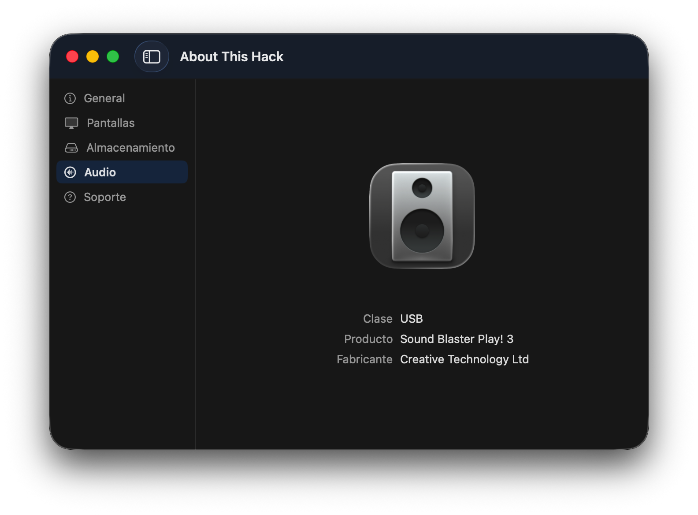
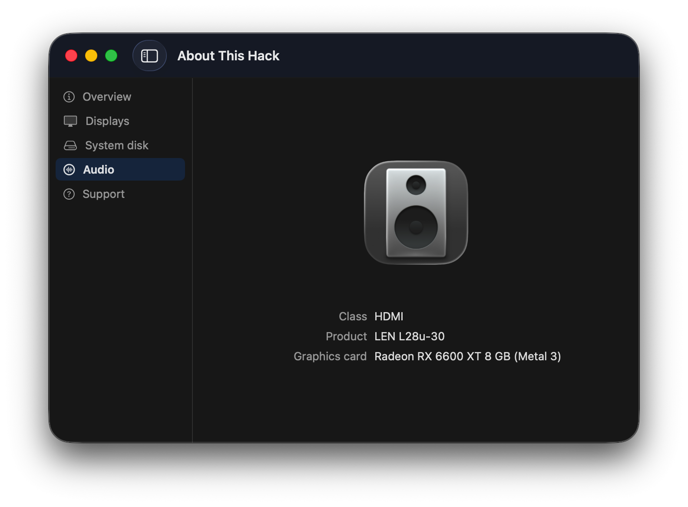
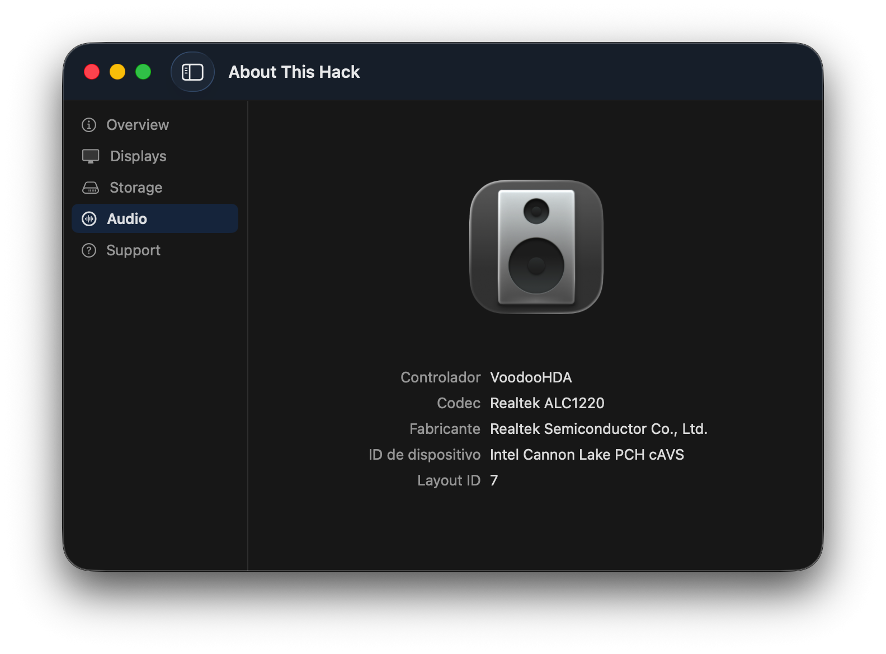
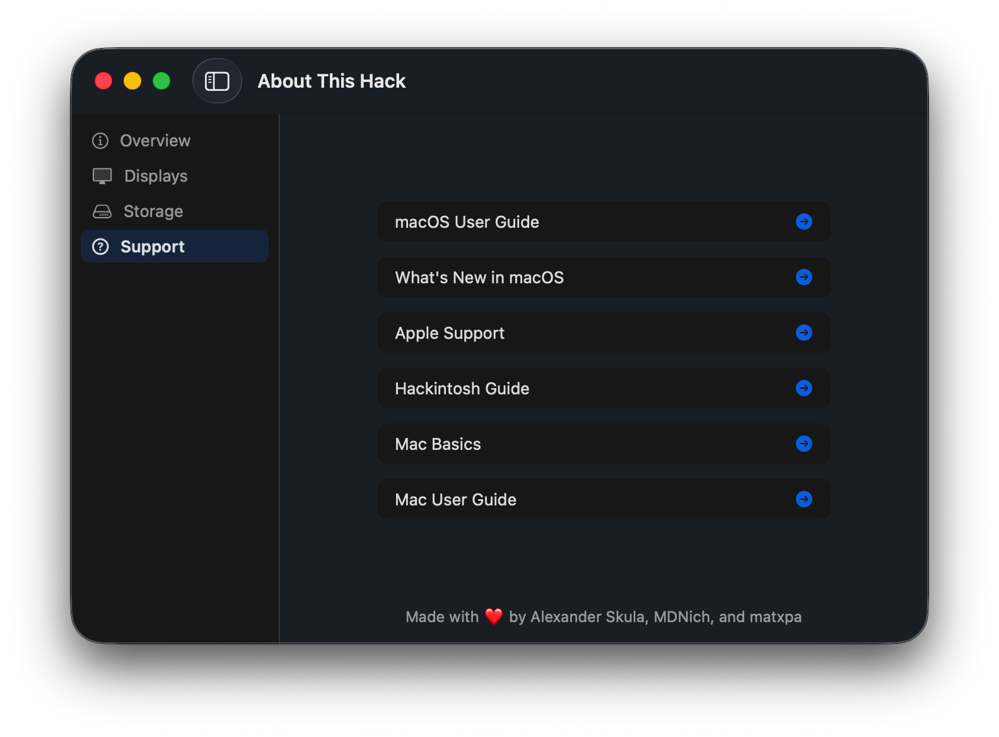

# About This Hack: Your Mac's Story, Beautifully Told, now in SwiftUI

| |
| --- |
|  |

## Migration to SwiftUI

2009-Nissan-Cube is the author of the original [About This Hack](https://github.com/2009-Nissan-Cube/About-This-Hack) repository, excellent project that Hackintosh users really like. About This Hack was built with AppKit-Swift. For graphical interfaces, AppKit uses Interface Builder files, which are more complex to manage compared to SwiftUI's simpler code.

I have worked on the migration of the project from AppKit-XIB to pure SwiftUI, adopting a modern interface with a left-hand sidebar containing links to the four tabs, whose values ​​are displayed on the right. Fonts and other elements have been enlarged, improving readability on high-resolution screens.

Some will like it, some won't, and many others would have done it differently (probably better). Therefore, issues and pull requests are welcome.

**Main changes**

- Migrate main UI from AppKit-XIB to SwiftUI keeping app functionality
- Minimum target is macOS 13.5+
- App bundle size has been reduced from 29 to 11 MB
- Unchanged SwiftUI Settings window (custom logo)
- Replace ATHLogger with print statements (error/warning prints where failures are meaningful for debugging)
- Replace macOS version icons with liquid glass badges
- Add language menu and language selector window (en, es, fr, it)
- Rework the Displays UI to enable full display counts (removed hard limit of 3); use a horizontal ScrollView if more of 3 displays are found
- Center window content when sidebar is hidden
- Update displays detection: remove `scr.txt` intermediary file for `SPDisplaysDataType`, `system_profiler SPDisplaysDataType` is written to `scr.txt` and then read back into the cache, the file round-trip is unnecessary
- Replace the custom updater system by Sparkle
- Main version has opaque windows, but there is a version with translucent windows (`About This Hack-glass`)
- Add audio tab with audio information (work in progress).

You can read about the migration process in [AppKit-XIB to SwiftUI](DOCS/AppKit-XIB-to-SwiftUI.md).

---

## Preface

Discover the heart of your macOS device with About This Hack: a sleek, intuitive hardware info app that brings back the beloved classic 'About This Mac' interface while offering a treasure trove of additional features. Whether you're on a Hackintosh or a real Mac, experience the best of all worlds with About This Hack!

# Key Features

## Overview

A throwback to the (better) About This Mac view from pre-Ventura. Get instant access to essential system specs, including your computer model, OS version, and processor details. Hackintosh users will appreciate the Clover or OpenCore bootloader version display.

> 💡 Pro Tip: Click the icon next to your serial number to hide it for screenshots!

## Displays

Visualize your connected displays with their respective resolutions.

| |
| --- |
|  |

## Storage

Get a clear picture of your startup disk, including name, available space, and disk type, all presented with an easy-to-read usage bar.

| |
| --- |
|  | 

## Audio (WIP)

Check audio information. This applies only to Hackintosh; original Macs do not have an audio tab.  Macs with OpenCore / OCLP are treated as Hackintosh.

The Audio tab is displayed in these situations:

- AppleALC.kext + AppleHDA.kext
- VoodooHDA.kext + `getdump`
- USB audio
- HDMI or DisplayPort audio.

| | |
| --- | --- |
|  |  |
|  |  |

**Note**: `getdump` is a tool available in the VoodooHDA repository. The download link is usually found in the resources section of each VoodooHDA release. The latest version is available at this [link](https://github.com/CloverHackyColor/VoodooHDA/releases/download/Release312/getdump.zip). VoodooHDA users must have `getdump` installed to get the audio tab. Simply copy the tool to `/usr/local/bin` and that's all.

## Support

Access a list of support resources for both Mac and Hackintosh users.

| |
| --- |
|  |

## Tooltips

Some values show more details when hovered over. See if you can find them all! 😉

## Custom Logo

Want to personalize your About This Hack? You can now replace the macOS logo in the Overview tab with your own custom image!

1. Go to **About This Hack > Preferences...** (or press ⌘,)
2. Drag and drop your custom PNG image (must be 1024x1024 pixels)
3. Your custom logo will instantly appear in the Overview tab
4. Click "Reset to Default" anytime to restore the original macOS logo

**Note:** The image must be in PNG format and exactly 1024x1024 pixels in size.

## Getting Started

1. Download the latest release [here](https://github.com/perez987/About-This-Hack/releases/latest)
2. Drag the app to your Applications folder
3. Launch and explore!
4. If you get this warning when opening the app for the first time:
 `The application is damaged and cannot be opened.` 
Or this one:
 `Could not verify that Download Full Installer does not contain malicious software.` 
With the recommendation in both cases to move the file to the Trash:

   - Go to `System Preferences` → `Security & Privacy`
   - You'll see a notice saying "About This Hack app is blocked"
   - Click "Open Anyway".

> 📍More info: You can read about ways to fix Gatekeeper blocking an app in [App is damaged](DOCS/App-damaged.md).

## Compatibility

- Supports macOS 13.5 Ventura and newer
- Not compatible with Linux or Windows.

## Credits

A big thank you to our contributors:

- [matxpa](https://github.com/matxpa) for doing so much and helping add so many features.  
- [MDNich](https://github.com/MDNich) for helping out a ton with features, code, and setting up the update server.  
- [LordNaut](https://github.com/Nautilus704) for helping me fix stuff with AppDelegate and sorting out a bunch of minor, but important features!  
- [Ben216k](https://github.com/Ben216k) for being awesome, providing some of the commands, and helping me debug a lot.  
- [Snoopy](https://macosicons.com/#/u/Squid4572) for helping create the new icon.  
- The internet for helping me with a lot of the code.

